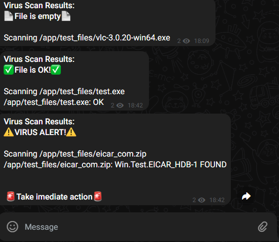

# Ansible Magnum Opus
Projectopdracht Oscar Alexander

## Introductie
Deze Magnum Opus voor het vak 'Infrastructure As Code' heeft de bedoeling om een volledig functioneel, cloud-ready open-surce solution op Rocky Linux 9 te bouwen. Deze rol zorgt voor gemakkelijke deployment over verschillende IAAS cloud providers of VM enviorments.  Het is ontworpen om een gemakkelijk te bereiken virus scanner in werking te brengen a.d.h.v Clamav scans. Je upload files via een local hosted website, en krijgt daarna het resultaat van de scan op je gsm te zien.
<br></br>


## Project Structuur Overzicht
.
├── ansible
│   ├── ansible.cfg           # Config file for ansible
│   ├── playbooks             # Playbooks directory
│   ├── roles                 # Has all the needed roles
│   └── vars                  # Main variable file, overwritten by Semaphore variables
├── docker
│   ├── docker-compose.yml    # Main docker compose file
│   ├── test_virus            # All the files needed by docker for test virus script
│   └── website               # All the files needed by docker for website
├── image.png
├── README.md
├── test_files                # Some test virus files!! Be careful
│   ├── eicar_com.zip
│   ├── test.exe
│   └── vlc-3.0.20-win64.exe
├── tests                     # Virus test files
│   └── test_virus 
├── vars                      # Env file
└── website                   # Website files

# Vereisten
- Operating System: Rocky Linux 9 met de meest recente updates.
- Ansible
- Git
- Telegram account met een bot api key.
- SSH toegang tot target. (met sudo rechten)
- Basis begrip van Ansible en YAML syntax.

### Bewerken van configuratie 
Configureer eerst twee belangrijke bestanden zodat de deploy lukt.
1. **vars/main.yml**
    Als je geen Semaphore gebruikt moet je de variabelen instellen. Normaal is de default configuratie oke. Als je Semaphore gebruikt kan je de variabelen aanpassen via de enviorment:


2. **playbooks/hosts**
    Voeg hier het ip adres van je target toe. Er staat een voorbeeld configuratie, verwijder deze en voeg onder ```[nodes]``` het ip toe.

### Het playbook uitvoeren
Nadat de hosts file is aangepast kan je de playbook uitvoeren met het volgende commando (open een terminal in /ansible/):
```bash
ansible-playbook -i playbooks/hosts playbooks/playbook.yml
```

### Gebruikte software
Ik licht hier kort de belangrijkste software componenten toe:
- Clamav - Virus scanning software
- Docker - Containerization
- Docker Compose 
- Ansible - Deployment
- Semaphore - UI for Ansible
- Python - Website run time enviorment
- Flask - Website hosting

### Systemen met support
- Rocky Linux 9
- CentOS 7
- Ubuntu Jimmy Server

## Rollen beschrijving
In de [/ansible/roles/](https://github.com/canuski/IAC-Cloud-Project/tree/main/ansible/roles) vind je alle roles terug die ik gebruik. Hieronder licht ik ze allemaal beknopt toe. Elke rol heeft een specifieke functie. Ik heb deze rollen geschreven voor verschillende besturingssystemen, ik licht nu enkel die voor Rocky Linux 9 toe.

### Role 'packages_install' 
[main.yml](https://github.com/canuski/IAC-Cloud-Project/blob/main/ansible/roles/packages_install/tasks/main.yml)
Zorgt ervoor dat alle pakketten zijn geupdate naar de meest recente versie, en dat de basis pakketten die nodig zijn voor de opdracht, geinstalleerd zijn.

### Role 'set_hostname'
[main.yml](https://github.com/canuski/IAC-Cloud-Project/blob/main/ansible/roles/set_hostname/tasks/main.yml)
Zet simpleweg de hostname op een geconfigueerd variable.

### Role 'clamav_setup'
[main.yml](https://github.com/canuski/IAC-Cloud-Project/blob/main/ansible/roles/clamav_setup/tasks/main.yml) 
Installeerd de nodig pakketten voor Clamav, start de service, past de configuratie aan en start een cronjob script om de database up-to-date te houden.

#### Role 'docker_setup'
[main.yml](https://github.com/canuski/IAC-Cloud-Project/blob/main/ansible/roles/docker_setup/tasks/main.yml)
Installeerd de noodzakelijke pakketten voor Docker te gebruiken op Rocky Linux 9. Ik maak gebruik van de Docker CE.

### Role 'docker-compose_setup'
[main.yml](https://github.com/canuski/IAC-Cloud-Project/blob/main/ansible/roles/docker-compose_setup/tasks/main.yml)
Zet de docker omgevingen op en kopieert de nodige files.


## Extra's
Ik heb een aantal extras gemaakt.

### Semaphore install

Volg deze stappen, of volg de officele stappen van Snap [hier](https://snapcraft.io/install/semaphore/rhel). Deze snap install werkt goed, ik had steeds authentication errors als ik de Docker compose gebruikte.

1. **Voeg het EPEL-repository toe:**
   Semaphore is afhankelijk van pakketten die beschikbaar zijn in het EPEL repo. Voer de volgende commando uit om het EPEL-repo toe te voegen:
   ```bash
   sudo dnf install https://dl.fedoraproject.org/pub/epel/epel-release-latest-9.noarch.rpm
   ```
2. **Upgrade het systeem:**
   Zorg ervoor dat je systeem volledig is bijgewerkt:

   ```bash
   sudo dnf upgrade -y
   ```
3. **Schakel optionele en extra repositories in:**
   Voeg meer repos toe met pakketten die Semaphore kan gebruiken:

   ```bash
   sudo subscription-manager repos --enable "rhel-*-optional-rpms" --enable "rhel-*-extras-rpms"
   ```
5. **Installeer Snapd:**
   Semaphore kan geïnstalleerd worden via Snap:
   ```bash
   sudo dnf install snapd -y
   sudo systemctl enable --now snapd.socket
   sudo ln -s /var/lib/snapd/snap /snap
   ```
6. **Installeer Semaphore:**
   installeer Semaphore via Snap:
   ```bash
   sudo snap install semaphore
   ```


## Meerde Systemen Support

Ik heb support voor meerdere systemen, zoals CentOS en Ubuntu. Ubuntu was moeilijker, want het blijft Ubuntu. In de playbook.yml vind je de verschillende systemen terug. Voor elk systeem heb ik aparte rollen die worden aangeroepen met een ```when: ansible_facts['distribution'] == 'Rocky'```. Ansible detecteerd welk OS je gebruikt.


